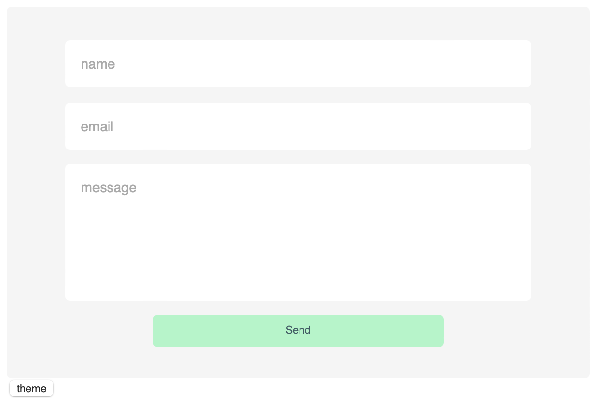

# contact form react component 

### please refer to the package.json or prior to use install both styled-components and emailjs.

#

### this component will allow someone to fill out the contact form on your portfolio or website and send an email directly to you. the email will contain a name, email, and message. for more information visit https://www.emailjs.com. 

#

### if you go straight to the contact form index.js you will find how I import emailjs and the functions to complete that send email functionality. you will have to enter your own information and sign up with emailjs.

        const sendEmail = (e) => {
        e.preventDefault();
        // ENTER YOURE INFORMATION HERE
        emailjs.sendForm('YOUR_SERVICE_ID', 'YOUR_TEMPLATE_ID', form.current, 'YOUR_PUBLIC_KEY')

        .then((result) => {
             alert(result.text)
        }, (error) => {
             alert(error.text)
             })  
        }

#

## install necessary packages 

        npm i styled-components

        npm i emailjs-com

#

## by William Wong
### https://github.com/billycwong19
